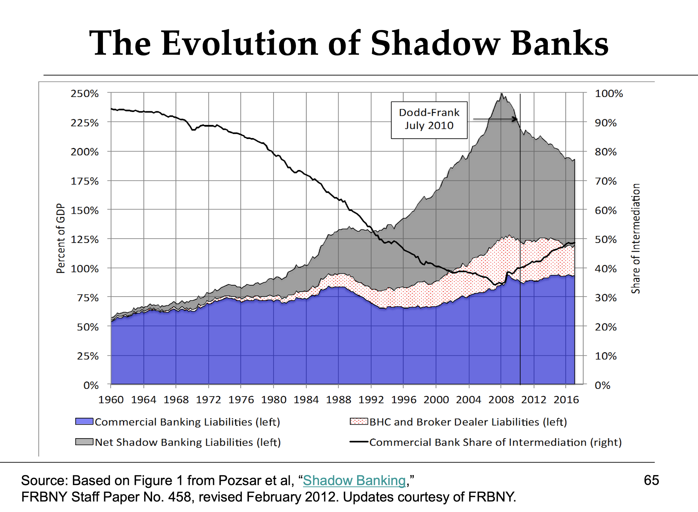
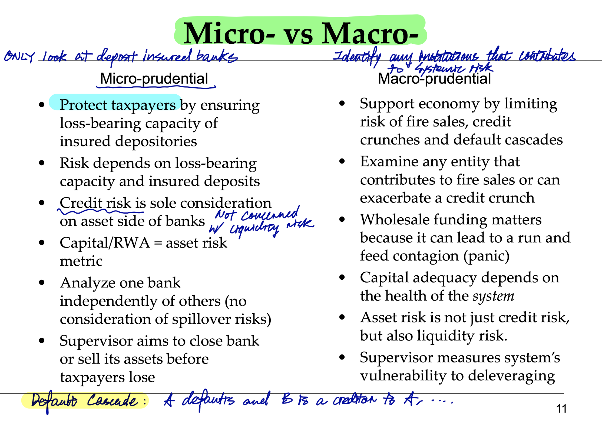

# Midterm review notes 📝

- [Midterm review notes 📝](#midterm-review-notes-%f0%9f%93%9d)
  - [Materials covered](#materials-covered)
  - [Big picture questions to focus on](#big-picture-questions-to-focus-on)
  - [1. Money and the Financial System](#1-money-and-the-financial-system)
    - [What is money](#what-is-money)
    - [Liquidity](#liquidity)
      - [An illustration of illiquidity in the 08 crisis](#an-illustration-of-illiquidity-in-the-08-crisis)
    - [Types of money](#types-of-money)
    - [Financial instruments](#financial-instruments)
      - [Financial instruments' money-like features](#financial-instruments-money-like-features)
    - [Financial markets](#financial-markets)
    - [Financial institutions (intermediaries)](#financial-institutions-intermediaries)
    - [Financial system trends](#financial-system-trends)
  - [2. Economics of financial intermediation (economics of information)](#2-economics-of-financial-intermediation-economics-of-information)
    - [Key financial intermediaries functions](#key-financial-intermediaries-functions)
    - [Information economics](#information-economics)
      - [Asymmetric information leads to Adverse Selection and Moral Hazard](#asymmetric-information-leads-to-adverse-selection-and-moral-hazard)
      - [Managing adverse selection](#managing-adverse-selection)
      - [The Public Goods Problem](#the-public-goods-problem)
        - [Relationship between information and public goods](#relationship-between-information-and-public-goods)
        - [Credit ratings as a public goods](#credit-ratings-as-a-public-goods)
      - [Moral hazard](#moral-hazard)
        - [The debt overhang problem](#the-debt-overhang-problem)
        - [Managing moral hazard in insurance](#managing-moral-hazard-in-insurance)
        - [Managing moral hazard in mutual funds](#managing-moral-hazard-in-mutual-funds)
      - [LIBOR](#libor)
      - [Managing information asymmetry is costly](#managing-information-asymmetry-is-costly)
      - [Asymmetric information: concealing leverage](#asymmetric-information-concealing-leverage)
    - [Depository institutions (banks)](#depository-institutions-banks)
      - [Why do banks rely on deposits](#why-do-banks-rely-on-deposits)
      - [Sucurities in banks' assets](#sucurities-in-banks-assets)
      - [Why real estate is an important part of banks' loans](#why-real-estate-is-an-important-part-of-banks-loans)
      - [Off-balance-sheet exposures](#off-balance-sheet-exposures)
      - [The disappearance of uncollateralized interbank lending (the Federal Funds Market)](#the-disappearance-of-uncollateralized-interbank-lending-the-federal-funds-market)
      - [Collateralized borrowing: repurchase agreements (Repo)](#collateralized-borrowing-repurchase-agreements-repo)
      - [Highly leveraged](#highly-leveraged)
      - [Bank risks](#bank-risks)
        - [Liquidity risk](#liquidity-risk)
        - [Credit risk](#credit-risk)
        - [Interest rate risk](#interest-rate-risk)
        - [Trading risk](#trading-risk)
        - [Operational risk (e.g. cyber risk)](#operational-risk-eg-cyber-risk)
  - [3. Financial industry structure & regulation](#3-financial-industry-structure--regulation)
    - [ETFs as hybrids of open and close-end funds](#etfs-as-hybrids-of-open-and-close-end-funds)
      - [Is ETF, Close-end funds, or Open-end funds the most consistent with the efficiency & resilience of the Financial System?](#is-etf-close-end-funds-or-open-end-funds-the-most-consistent-with-the-efficiency--resilience-of-the-financial-system)
    - [Insurance and tools](#insurance-and-tools)
      - [Re-insurance](#re-insurance)
      - [Catastrophe bonds](#catastrophe-bonds)
    - [Pension funds](#pension-funds)
      - [Defined benefit vs. defined contribution](#defined-benefit-vs-defined-contribution)
    - [Government-sponsored Enterprises (GSEs)](#government-sponsored-enterprises-gses)
      - [Frannie Mae & Freddoe Mac as Guaranteed To Fail institutions & Time Consistency](#frannie-mae--freddoe-mac-as-guaranteed-to-fail-institutions--time-consistency)
    - [Hedge funds](#hedge-funds)
    - [Private Equity and Venture Capital](#private-equity-and-venture-capital)
      - [Why did PE overtake the public market as a source of funds?](#why-did-pe-overtake-the-public-market-as-a-source-of-funds)
    - [Financial crises](#financial-crises)
      - [How runs can drive a solvent bank insolvent](#how-runs-can-drive-a-solvent-bank-insolvent)
      - [How a bank run evolves into a systemwide panic (multiple runs)](#how-a-bank-run-evolves-into-a-systemwide-panic-multiple-runs)
      - [The Diamond-Dybvig Model for bank runs](#the-diamond-dybvig-model-for-bank-runs)
      - [Crisis trigger: fall (shock) in net worth (asset values)](#crisis-trigger-fall-shock-in-net-worth-asset-values)
    - [Government safety net](#government-safety-net)
      - [Rationale for a government safety net](#rationale-for-a-government-safety-net)
      - [LOLR](#lolr)
        - [Why LOLR should not lend to insolvent banks](#why-lolr-should-not-lend-to-insolvent-banks)
        - [To whom should LOLR lend](#to-whom-should-lolr-lend)
      - [Deposit insurance](#deposit-insurance)
        - [Moral hazard problem](#moral-hazard-problem)
    - [Regulation](#regulation)
      - [Evolution of regulatory goals: stakeholder-oriented to system-oriented](#evolution-of-regulatory-goals-stakeholder-oriented-to-system-oriented)
      - [Micro-prudential regulation](#micro-prudential-regulation)
      - [U.S. regulatory issues: regulator shopping, regulatory capture](#us-regulatory-issues-regulator-shopping-regulatory-capture)
      - [Basel Accords](#basel-accords)
      - [Regulatory challenges](#regulatory-challenges)
  - [4 & 5: Systemic risk, Regulatory Reform](#4--5-systemic-risk-regulatory-reform)
    - [What is systemic risk](#what-is-systemic-risk)
      - [Features of systemic risk (defining properties)](#features-of-systemic-risk-defining-properties)
      - [Cont'd common features of systemic risk (when crisis happens)](#contd-common-features-of-systemic-risk-when-crisis-happens)
      - [Sources of systemic risk](#sources-of-systemic-risk)
    - [Managing systemic risk](#managing-systemic-risk)
      - [Time Consistency: a regulator's credibility](#time-consistency-a-regulators-credibility)
      - [Strategy for regulating systemic risk](#strategy-for-regulating-systemic-risk)
      - [Why don't markets resolve systemic threats](#why-dont-markets-resolve-systemic-threats)
      - [Micro vs. macro regulation](#micro-vs-macro-regulation)
      - [The interplay between macro and micro-prudential regulation](#the-interplay-between-macro-and-micro-prudential-regulation)
      - [Macro-prudential regulation](#macro-prudential-regulation)
      - [Capital requirements](#capital-requirements)
      - [Understanding capital requirements as a violation of M-M](#understanding-capital-requirements-as-a-violation-of-m-m)
        - [Why do banks consider equity finance to be expensive?](#why-do-banks-consider-equity-finance-to-be-expensive)
    - [Organization of the regulatory system](#organization-of-the-regulatory-system)
      - [FSOC (Financial Stability Oversight Council)](#fsoc-financial-stability-oversight-council)
  - [6. 08 Crisis, the Central Bank as LOLR](#6-08-crisis-the-central-bank-as-lolr)
    - [Causes](#causes)
    - [Runs](#runs)
    - [Crisis propagation](#crisis-propagation)
    - [Policy response](#policy-response)


## Materials covered

1. **Money and the financial system**:
   1. The role of finance in economic development
2. **Economics of financial intermediation (economics of information)**:
   1. How do financial institutions earn profit?
      1. Taking advantage of information asymmetry
   2. What accounts for the shifts between bank finance and other types of finance?
3. **Financial industry structure and regulation**:
   1. What is the role of the lender of last resort (LOLR)?
   2. How and why are regulations different in different countries?
4. **Managing systemic risk**:
   1. What is systemic risk and how can regulators address it?
   2. What is *macro-prudential* and *micro-prudential* regulation and how do they differ?
5. **Regulatory reform: The Dodd-Frank Act, Basel III, Financial CHOICE Act, and beyond**
   1. What are the strengths and weaknesses of the evolving U.S. regulatory framework?
   2. International regulatory challenges
6. **Case Study: The crisis of 2007-09 and the Central Bank as the LOLR**
   1. What caused the crisis? Why was it so broad, deep and prolonged?
   2. What role did the lender of last resort play in the Bear, Lehman and AIG episodes?
   3. How to distinguish between illiquidity and insolvency?
   4. How will carious regulatory reforms affect the next crisis?


## Big picture questions to focus on

1. What makes a financia system **safe (less vulnerable)**? What makes a 
   financial system **efficient**?
   1. These are two different things; achieving one may come at the expense of 
        the other.
   2. Financial systems don't usually operate on the efficiency-safety frontier,
        so policy makers can make a system both safer and more efficient.


## 1. Money and the Financial System

*What does a financial system do?*

- `Savings = Investment` (in a closed-off economy). **Financial system is a 
device that converts savings into investments**. It gathers savings and 
transforms them into investments. Whether a financial system does that well
has huge implications on the growth of an economy.
- **Allocation of risk to those who can best bear it**.
- **Payments mechanism**. Any FS with a vulnerable payments mechanism will be
  very risky. While technology often makes payments ***faster and cheaper***, 
  it may come at the expense of making the payment mechanism less safe.

The bridge analogy takeaway:

- Destabilizing feedback loops
- Move from a good equilibrium to a bad equilibrium in a short time
- Shock absorbers in Finance (self-repair): rely on equity finance

High domestic credit to the private sector (China, U.S.) indicates financial 
development because:
- without a system for overcoming info. asymmetry (in which case you face 
  adverse selection), you won't find much credit
- Property rights protection

Higher net interest margin in developing markets than developed markets:
- risk requires compensation. There's less risk in developed markets (more 
  tools to overcome information asymmetry, there's property rights protection)


### What is money

1. Unit of account
2. Means of payment
3. Storage of value


### Liquidity

**Market liquidity**: a measure of the ease with which an asset can be turned
into a means of payment.

**Funding liquidity**: ability to borrow to fund assets held on the balance 
sheet.

**Market liquidity and funding liquidity are closely related**

Market illiquidity drives asset prices down. If funders are unsure how much the
assets are worth, or unsure whether the fund recipient is solvent (due to 
declining asset prices), they're less likely to provide funds, drying up 
funding liquidity.

Financial institutions rely on short-term borrowing to fund long-term assets 
(loans):
- they act as if funding liquidity would be readily available
- they act as if market liquidity would not be disrupted, so they could sell
  off assets whenever they want without a discount

#### An illustration of illiquidity in the 08 crisis


- 3-month LIBOR rate incorporates
  - the risk free rate
  - liquidity premium
  - default premium
- OIS rate is the expected safe rate over the next 3 months

### Types of money

- Commodity money
- Fiat money
- **Deflation**: steady decline of aggregate price level
- **Disinflation**: slowing of inflation

Think of M1 and M2 as thresholds of liquidity. Any assets that are more liquid
than this threshold are included in M1 (or M2).

M1 and M2 aren't good indicators of inflation on the long run; technological
change may change asset liquidity, and M1 M2 may not keep up with updating 
what assets should and should not be included.

Alibaba and Tencent deposit all payment account funds at the Central Bank 
without any interest.

**Money market mutual funds (MMMFs)** as a prime example of **shadow banks**: 
institutions that perform the economic functions of a bank (transforming 
liquidity maturity and credit from one side of the B/S to the other), but does
not have the legal designation of a bank.

- Shadow banks don't face as much government oversight and doesn't enjoy 
  government guarantees
- Shadow banks that are *most* similar to banks have liabilities that can be 
  withdrawn without notice (like deposits)

After 1980, U.S. intermediation shifted from traditional banks toward shadow 
banks, including hedge funds, MMMFs, off-balance sheet vehicles (SIVs), etc.
Shadow banks can perform bank-like functions at a much lower cost.



### Financial instruments

**Definition**: the written legal obligation of one party to *transfer 
something of value (usually money)* to another party *at some future date*, 
*under certain conditions*.

- **Standardization** cuts costs; economies of scale; court-tested

#### Financial instruments' money-like features

- Means of payment
- Store of value
- **Transfer of risk (unlike money)**: money is a means of **final settlement**,
  while financial instruments allow you to transfer the risk you're not willing
  to bear to another party.

### Financial markets

The key role governments play in financial markets:
- investor protection (by enforcing information transparency)
- enforce property rights (e.g. entitled to a share of the firm's profit when 
  you own their stock)

### Financial institutions (intermediaries)

- Financial intermediaries all have to overcome information asymmetries
  - They all need to screen user of funds in advance, select the best projects,
    and monitor the use of funds

***Example: P.E. overtaking IPO as primary source of firm funding in the 
U.S.***: P.E. firms have better tools to monitor the use of funds because 
whenever they invest, they retain enough control over the firm and install 
managers to the board. They don't have to wait until P&Ls to know how well
the projects are going (overcoming information asymmetry). This is a more 
efficient monitoring mechanism than equity in the public world.

**Leverage**: the use of borrowing to finance part of an investment.

- Leverage increases bankruptcy risk
- Leverage (fragility) as:
  - x times their networth: $D / E$
  - How much asset value decline they can stand: $E / (D+E)$

You may have positive networth but is illiquid.

### Financial system trends

1. Technology (FinTech)
2. Making financial system more resilient
3. Banking the unbanked


## 2. Economics of financial intermediation (economics of information)

**Information asymmetry and information costs**

### Key financial intermediaries functions

1. Pool savers' resources and supply them to user of funds
2. Safekeeping and accounting services; payment system access
3. Supply liquidity
4. Provide risk diversification
5. Reduce information costs: choose the best investments from 
   those seeking finance

- ***liquidity transformation***: transforming short-term debts (deposits)
to long-term assets (loans)
- ***maturity transformation***: investments in long-term assets (loans) funded 
  by short-term debt (deposits). Banks generate return by taking advantage of 
  the upward-sloping yield curve: banks earn the difference between returns 
  generated by long-term assets and costs of short-term funding.
- ***credit transformation***: 

**Economies of scale**: declining unit cost as scale goes up

**Economies of scope**: declining unit cost as variety goes up

- certain economic activities go together: e.g. payment system access and money 
  safe-keeping.
- Makes financial access cheaper, but often sources of *conflicts of interest*.

**Liquidity insurance**:

- *Assuming everyone's liquidity needs are independent*, a bank can estimate,
  fairly accurately, how much funds will be withdrawn each day. The bank can
  invest the rest of the funds in higher-return assets. **By having 
  independent liquidity needs, each member of the bank is providing the others
  liquidity insurance**.
- *But if the assumption of independence no longer holds true*, liquidity 
  insurance breaks down. The bank cannot satisfy everyone's liquidity needs.
  - Thus there's **First Mover Advantage**: when everyone has the incentive to
    do the same thing (e.g. withdraw deposit), you have the incentive to be the
    first mover.

### Information economics

**Free rider -> underproduction of information**:

**Definition**: a person reaping the rewards of a good without purchasing it. 
[Free riding in finance primer](https://www.moneyandbanking.com/commentary/2017/12/17/free-riding-in-finance-a-primer).

#### Asymmetric information leads to Adverse Selection and Moral Hazard

| Problem | Timing | Feature | Question
| --- | --- | --- | --- |
| **Adverse selection** | before the transaction | Hidden attributes | how to distinguish good credit risks from bad?
| **Moral hazard** | after the transaction | Hidden actions | will borrowers user money as they claim? |

- [Adverse selection primer](https://www.moneyandbanking.com/commentary/2017/8/13/adverse-selection-a-primer).
- [Moral hazard primer](https://www.moneyandbanking.com/commentary/2017/9/24/moral-hazard-a-primer).

**Adverse selection** arises when one cannot *costlessly observe* attributes
of a counterparty / product prior to a transaction, allowing for "hidden '
attributes". ==> Collapse of market because of the fear of "bad lemons".

***Example: health insurance adverse selection***

- The population for health insurance will be adversely selected, because 
  healthy people don't have the incentive to get health insurance
- If insurance company charges the average rate, it will operate at a loss
  - How to solve adverse selection?
    - Solution 1: make health insurance mandatory

#### Managing adverse selection

... or distinguishing well-run organizations from bad ones

- Disclosure requirements (enforcement by gov't)
- Information production (what financial intermediaries do)
- Skin in the game
  - Collateral
    - Overreliance on collateral values (obtaining which is costless) instead 
      of information production (which is costly) may get firms in trouble in 
      bad times.
      - Some of the housing loans before the crisis had collaterals less than the loan
  - Net worth
    - Same purpose as collateral
    - If a firm fails on its loan, the lender can claim against its equity

Health care example: **compelled participation**

#### The Public Goods Problem

**Public goods** are:
- *nonrivalrous*: B can consume what A consumed
- *nonexcludable*: producer cannot prevent consumption

##### Relationship between information and public goods

- Information *is nonrivalrous*: once it's out in the public, everyone can consume it
- Information *can be non-excludable*.
  - In this case, because information producer does not fully reap the benefits 
    of production, **information will be undersupplied**.

##### Credit ratings as a public goods

- CRA Model changed from "user pay" to "issuer pay" in the 1970s:
  - "User pay" meant whoever cites the rating must pay. This model is no longer 
    tenable because of the invention of the xerox machine; ratings have then 
    become nonrivalrous.
  - "Issuer pay" means the party in need of a rating pays.

**The issuer-pay model became a huge incentive problem in the run-up to 08**.
CRAs have incentive to keep issuers happy. When issuers for structured finance
products became as concentrated as it was in the early 2000s, CRAs had to do
what aligned with the interests of the issuers to keep their business. 
Overrating the issuers' products is a **moral hazard** problem.

#### Moral hazard

*The incentive to cheat (hidden actions) is enormous, and the actors often 
think they can conceal it*.

- Examples
  - **Ponzi schemes**. Solution: severe punishment (by the government).
  - **The principal-agent problem**

In debt, overcome moral hazard by covenants. Equity finnance does not have this 
option.

##### The debt overhang problem

With high leverage, a firm's equity holders get all the upsides, while their
downsides are limited to their collaterals. The incentive for risk-taking is
bad for debt holders.

##### Managing moral hazard in insurance

If you have insurance, you have no incentive to worry. This is a bad action from
the insurer's point of view.

Solutions:

- Deductibles and co-pays (you have to pay for some; incentivizes you to take care)
- Unrecoverable losses
- Inspection (costly payment to monitor the insured party has no hidden action 
  that's bad to the insurer)

##### Managing moral hazard in mutual funds

- Managers have an incentive to misuse funds after they receive it
- Mutual funds are required by law to hire an independent custodian to 
  safeguard assets

**The free-riding problem**: everyone is assuming everyone else is doing the 
monitoring (they don't want to do it themselves because monitoring is costly).

#### LIBOR

*Conflict of interest / moral hazard*: the derivatives floor in the same bank 
can profit from change in one basis point in LIBOR. So the firm has the 
incentive to quote a LIBOR rate that is in favor of their own trades. *The 
benefits are enormous, and the actors think they can conceal it.*

It is not a market-based system. Banks would have no incentive to submit LIBOR
quotes if the British regulator stopped compelling panel banks to submit.

#### Managing information asymmetry is costly

- **Screen** for adverse selection
- **Monitor** for moral hazard
- Screening and monitoring are costly
  - Who wants to pay for screening and monitoring in good times when benefits
    are the greatest in bad times?
- Capital market application
  - Screening:
    - *Underwriters screen and certify* firms seeking to raise funds through IPO
    - It is difficult to raise funds without an underwriter's support
  - Monitoring:
    - Mutual funds, hedge funds, pension funds, etc. hold significant shares in 
      individual firms

#### Asymmetric information: concealing leverage

```
leverage (gearing) ratio    = cost of investment / owner equity
capital ratio               = owner equity / cost of investment
```

- Conceal leverage through off-balance sheet operations
  - providing option on a loan (line of credit)
    - Doesn't show up on the B/S until the loan is taken out
    - Contingent asset
  - Commercial paper backstop loans
    - loans to CP issuers, when CP issuers cannot re-issue CPs for whatever reason (e.g. on 9/11/01)

### Depository institutions (banks)

**Depository** and **non-depository** institutions differ primarily on the 
liabilities side of the B/S (provider of funds).

#### Why do banks rely on deposits

- **explicit subsidy** (FDIC deposit insurance)
- **implicit subsidy** (TBTF)
- Deposits are non-volatile (under normal times, people don't usually withdraw deposits)


#### Sucurities in banks' assets

- **Securities as secondary reserves** (second liquid compared to cash).
- U.S. banks can hold bonds but not stocks
- securities holdings roughly evenly split between treasuries and other
  - Other securities are primarily MBS

#### Why real estate is an important part of banks' loans

1. Traditionally exposed to this area.
2. MBS allow banks to sell the mortgage loans they make, providing mortgages 
   with more liquidity.
3. Credit supply to nonfinancial firms expanded due to the expansion of 
   corporate bond markets and commercial papers. With less commercial loans, 
   mortgages play a bigger role.

#### Off-balance-sheet exposures

- **Lines of credit**: an *option* for a customer to take out a loan

Off-balance-sheet instruments make outsiders hard to understand the total risks
a bank is exposed to.

#### The disappearance of uncollateralized interbank lending (the Federal Funds Market)

- **The federal funds market** offers banks with capital shortfalls short, 
  uncollateralized loans
  - The market collapsed after the 08 crisis.
  - Banks no longer trust each other
  - Key lenders in the federal funds market today are GSEs (gov't sponsored 
    enterprise), e.g. Freddie Mac and Fannie Mae. This is because they're not 
    authorized to get interest payments at the Fed, but they can get interest 
    from this market.

#### Collateralized borrowing: repurchase agreements (Repo)

**Repos** are overnight, collateralized loans.

- *Haircut*: the better the collateral, the smaller the haircut. Haircut is
  essentially a discount on the amount of collaterals you're posting. For
  treasuries, for instance, the haircut may be as low as 1%, meaning for every
  $100 treasuries you post up, the lender will lend $99.
- Collateral qualities range overtime.
  - **Rollover risk**: the risk of not being able to rollover your overnight
    loans. A good collateral that has 5% haircut yesterday may turn into a 
    bad collateral with 100% haircut today.

Banks are required to hold capital === Finance some assets with equity

Bank capitals are not sitting idle -- they're simply a financing mechanism. The
issue is banks thinks equity finance is expensive.

#### Highly leveraged

Banks dislike equity finance. They think equity finance is expensive

**Why?** Unsettled question. Possible reasons include:

- Government safety net encourages debt finance and risk-taking
  - Deposit insurance; TBTF; LOLR.

#### Bank risks

##### Liquidity risk

Banks face liquidity risk on both sides of the balance sheet.

- Deposit withdrawals
- Takedowns of lines of credits

**Manage liquidity risk**

`bank reserve = vault cash + deposits at Federal Reserve`

- Hold excess reserves (foregoing returns)
- Sell assets (Treasuries, marketable loans)
- Borrow (signalling the bank is desperate)
  - from the Fed

##### Credit risk

**Credit risk** is the risk that banks' loans and securities holding will 
default.

**Manage credit risk**

- *Diversification* of assets exposed to credit risks
- *Credit analysis* of the borrower
- Collaterals, etc.

##### Interest rate risk

short-term liabilities and long-term assets.

**Why did banks become more profitable when the interest rate rose from 0?**

Banks already hedged against potential interest rate rises (although at a cost).
Moreover, because deposits are sticky, consumers did not demand for a higher 
interest rate even though the interest rate has risen. 

##### Trading risk

**VaR**: there's an x% chance you'll lose more than N today.

Moral hazard of traders (*principal-agent problem*): traders get a share of the 
profits, but the bank pays for the losses.

##### Operational risk (e.g. cyber risk)

Cyber risk and negative externality:

- Firms are hesitant to report hacks, even though such reports will enchance 
  system safety
- Gov't's role in promoting information sharing and cooperation


## 3. Financial industry structure & regulation

### ETFs as hybrids of open and close-end funds

- ETFs behave like open-end mutual funds (elastic supply) in good times, and 
  like close-end in bad times (inelastic supply)
  - it behaves like open-end mutual funds in good times because Authorized
    Participants will arbitrage to prevent ETFs from drifting too much away
    from its index
  - in bad times, APs are illiquid and the market is illiquid too. APs may
    not be able to perform its operations, and ETFs behave like close-end
    funds, allowing its value to deviate substantially from its underlyings.

#### Is ETF, Close-end funds, or Open-end funds the most consistent with the efficiency & resilience of the Financial System?

- ETF
  - In good times, ETF track index prices
  - In bad times, nobody is authorized to perform creation / redemption (APs 
    aren't liquid enough to do so). There's **no first mover advantage**. This
    is unlike open-end funds, where the first people to redeem can get the
    most value.

***The design of a financial instrument can influence the efficiency and 
resilience of a financial system.***

### Insurance and tools

The following are tools designed to keep insurance companies solvent in a 
catastrophe.

#### Re-insurance

Insurance that insurance companies buy to reduce their risk of insolvency
in a major claim event.

#### Catastrophe bonds

- Investors pool money as principals of a bond and pay to an insurance company.
- The insurance company pays coupon to investors.
- If a catastrophe happened, the principal would not be returned.

### Pension funds

**The U.S. has seen a movement away from defined benefit to defined 
contribution**.

#### Defined benefit vs. defined contribution

| Type | Definition | Risk bearer | Example
| --- | --- | --- | ---
| Defined benefit | calculate payment received | Firm | SS
| Defined contribution | calculate payment required | Individual |

### Government-sponsored Enterprises (GSEs)

Example: Fannie Mae and Freddie Mac (subsidizes mortgages)

#### Frannie Mae & Freddoe Mac as Guaranteed To Fail institutions & Time Consistency

- Guaranteed to fail due to 40:1 leverage
- Despite government insisting they won't be bailed out, people did not buy
  that argument because of the time consistency problem: government has the 
  authority and incentive to bail them out if they fail
  - People's belief that they'd be bailed out was supported by the fact that
    they traded a few bases point above treasuries, despite their leverage

### Hedge funds

Most hedge funds don't perform bank-like services because of **lockups**: you 
don't have liquidity on-demand, so you can't run (no first mover advantage).

### Private Equity and Venture Capital

#### Why did PE overtake the public market as a source of funds?

- **PEs have more tools for corporate control**
  - addresses moral hazard
- In the last 2 decades, a lot of new firms are based in I.T.; VCs and PEs can
  value these firms better than the capital market.

### Financial crises

Financial crises are hard to prevent.
Financial crises are costly.

#### How runs can drive a solvent bank insolvent

Suppose a bank is solvent (may not be well capitalized, but solvent). As a 
depositor at the bank, in a bad state of the world, you can either run or not 
run. If you run (first) you get your deposit; if you don't run and others run,
you'll find yourself running last and get nothing. ==> You have an incentive 
to run (and so does everyone else). Therefore:

- **bank runs can occur for solvent banks too**
- **bank runs (and insolvency) can be a self-fulfilling prophecy**

#### How a bank run evolves into a systemwide panic (multiple runs)

1. The existence of **lemons** (we know some banks are insolvent)
2. **Asymmetric information** and information is costly to obtain
3. **Adverse selection** (worry about hidden attributes)

*One of the best ways to end / prevent a crisis is to improve the quality of 
information (so you know which one is the lemon).*

#### The Diamond-Dybvig Model for bank runs

- Required assumption for bank runs
  1. Transformation of long-term, illiquid assets into short-term, liquid 
     liabilities
  2. Sequential promise to pay at face value on demand
  3. Risk-averse investors
- Shock -> *Asset value decline*
  - Confidence crisis
  - Bank run as a self-fulfilling prophecy (first mover advantage, adverse 
    selection)
  - "Even sunspots could cause runs if everyone believed that they did."
    - All it takes is for you to believe everyone else had an incentive to run.

#### Crisis trigger: fall (shock) in net worth (asset values)

- Crisis are essentially when everyone ask for liquidity at once
- **Fire sales** occur when selling is *synchronized*
- **Fire sale externality**: fire sale of firm A damages asset values of other 
  financial intermediaries
  - leads to **the paradox of leverage**

### Government safety net

1. Lender of last resort
2. Deposit insurance
3. Guarantees (TBTF)

#### Rationale for a government safety net

- Why
  - Financial system is integral to a wellbeing of an economy
    - Payment system, supply of credit to healthy borrowers
  - Financial system is highly fragile
    - illiquid assets funded with liquid liabilities is by nature instable
    - Bank runs and fire sales are contagious

**Safety net helps resolve the lemon problem, but increases the moral hazard 
problem.** With government guarantees, bank runs are much less likely. However,
now banks have the incentive to be the *unhealthy* one, rather than the healthy
one. This is because banks' downsides are limited due to government guarantees.

#### LOLR

##### Why LOLR should not lend to insolvent banks

1. Even with LOLR's bail out, people still have the incentive to run
   -  LOLR is a government institution; it's first in line, before all the other
      creditors. So from the other creditor's perspective, the bank still 
      remains insolvent, because while LOLR could make the bank solvent,
      the bail-out money will be taken away ASAP, and that could render the
      bank insolvent again.
2. If liquidity is provided even to insolvent banks, then banks have no 
    incentive to take care
3. **[important]:** in lending to insolvent banks, LOLR undermine its status
    as the lender of last resort
     - LOLR exists so that solvent banks will have credit (so they don't need
       to become insolvent) in a bad state of the world
     - If people believe this, there's no incentive for a bank run (because 
       banks will not be driven out of business due to illiquidity)
     - If LOLR signals they're willing to lend to insolvent banks, in the 
       future solvent banks will be hesitant to borrow from LOLR, defeating
       LOLR's purpose. Solvent but illiquid banks will think borrowing from
       the LOLR signals that it is insolvent (even though it isn't), and that
       stigma will make it very difficult to do business in the future.
 
##### To whom should LOLR lend

- **Lend to anyone with good collateral at a penalty rate.**
  - Good collateral as a proxy for solvency.
  - Penalty rate: lender of *last resort*.

#### Deposit insurance

##### Moral hazard problem

- *Insurance without upfront fees cause moral hazard.*
  - Banks' leverage greatly increased since the creation of deposit insurance.
  - TBTF (bank managers sometimes expect bailouts)

**Trade-off between crisis prevention and crisis management**:

Deposit insurance helps manage a crisis (because it reduces people's incentive
to run on banks; however, moral hazard increases bank managers' risk-taking
and hinders crisis prevention.

This tradeoff can be managed by **self-insurance** (banks having a shock 
absorber (capital)).

### Regulation

#### Evolution of regulatory goals: stakeholder-oriented to system-oriented

- Traditional goals:
  - Protect investors: information disclosure; fairness
  - Protect depositors
  - Protect taxpayers: don't abuse deposit insurance
  - Market efficiency
- New goals:
  - Limit systemic risk (which begs the question: how do you define systemic risk)
  - Crisis prevention 

#### Micro-prudential regulation

- Focuses on individual institutions
  - Rules for banks to follow
    - Compelled disclosures
      - Stress tests
    - Restrictions on assets (U.S. banks cannot hold equities)
    - etc.
  - Supervision & examination
    - ***Prevent evergreening*** by requiring banks to show documentation on
      loan payments.
  - Capital requirements as self-insurance (minimum capital to risk-weighted assets)
    - ***How do banks game capital requirements?*** 
      - Risk characteristics assigned to an asset usually move much more slowly
        compared to their actual risks. Banks load up on assets that 
        are actually riskier than their weights imply.

#### U.S. regulatory issues: regulator shopping, regulatory capture

**Regulator shopping**: choose the regulator that regulates the least; issue 
arises when there's too many regulators

**Regulatory capture**: regulator depends on fees provided by regulatees

#### Basel Accords

- **Basel:** international financial standard-setting arrangements that depend
  on cooperation among domestic regulators.
- Rules aimed for internationally active banks
- **Basel I (1988) & Basel II (2004):** minimum RWA 8%. Banks game weights to 
  boost leverage.
- **Basel III (2010)**
  - Raises required capital cushion and tightens definition of capital
    - Assets that are worthless when banks are no longer a going concern (e.g. 
      goodwill, deferred tax assets) is not considered as capital
  - Sets first international restriction on leverage (3%)
    - Assets are un-risk weighted. 3% was low, probably chosen because
      European banks weren't well capitalized at the time.
  - **Capital conservation buffer** (restricts payouts if capital deteriorates)
    - Regulators can stop banks that are undercapitalized from payout to 
      shareholders (share buyback, dividends, etc.)
  - **Capital surcharge** for systemically risky banks
    - Akin to taxes
  - **Counter-cyclical capital buffer** (reduce pro-cyclicality or credit supply)
    - Raise capital buffer in good times and lower in bad times
  - New liquidity requirements that limit maturity / liquidity mismatch between
    assets and liabilities
    - systemically risky institutions need to hold relatively liquid assets
      on their balance sheet; and limit maturity mismatch.
  - (Probably did make the system safer)

#### Regulatory challenges

1. Firms can change their risk profiles very quickly, so no matter what risk
    risk restrictions a regulator imposes on a firm, they can adjust
    adjust accordingly very quickly
     - Derivatives can mask risk on an intermediary's balance sheet
2. Except for the largest banks, size is not a good proxy for systemic risk
3. Regulation by legal form, not economic form, leads to regulatory arbitrage
4. Markets (e.g. repo) (or the design of instruments) can be systemic
5. Structure of regulatory agencies is complex
    - The U.S. domestic regulatory landscape is complex
    - Globalization entails need for regulatory cooperation (timely response)


## 4 & 5: Systemic risk, Regulatory Reform

- Regulatory goals (Disclosure & Fairness)
- Depositor protection
- Tax payer protection: deposit insurance
- Efficiency: well-functioning markets
- Stability (limit systemic risk, crisis prevention; ending TBTF)

### What is systemic risk

**Bad state of the world**: when the system is short on capital.

Regulators assess a firm's systemic risk by assessing what would happen to it 
when it faces capital shortfall in a bad state of the world. *If it would bring
down the financial system, then it has a high degree of systemic risk.*

#### Features of systemic risk (defining properties)

1. Threaten key functions of the financial system
   1. e.g. provision of liquidity; provision of credit
   2. What are other key functions of a financial system?
2. ***Tail risks*** with low probability, high cost
3. ***Negative externality***: uncompensated cost imposed by some financial 
    institutions onto others (akin to pollution)
4. Becomes acute when the FS is under-capitalized (bad state) and unable to 
   withstand a significant shock to asset values
5. ***Resiliency*** is defined by 1) vulnerability to shocks is low and 2) 
   recovery from shock is *quick* and *automatic*
6. Design on financial instruments and markets can influence the resilience of 
   an FS

#### Cont'd common features of systemic risk (when crisis happens)

1. Sudden change of equilibrium (persistent state A to B)
2. A heightening of volatility (VIX: the implied vol. of S&P500 options)
3. Co-movement of asset prices
   1. *In crisis everyone wants liquidity and safe assets.* Every other asset's 
        prices move downward when compared to the liquid and safe asset.
4. Contagion / chain reaction
   1. Common exposures
5. Illiquidity (**Key driver in asset prices co-movement**)
   1. Liquidity crisis is systemic and non-diversifiable
6. Interaction between the FS and the real economy provides adverse feedback

#### Sources of systemic risk

- **Common exposures** (cross-sectional dimension)
  - Common assets, currencies
  - Liquidity and rollover risk (e.g. repo)
  - Dependencies on *markets* and *counterparties* (TBTF)
- **Pro-cyclicality** (time dimension)
  - Asset (and collateral) valuations
  - The interplay between volatility (VaR) and leverage, liquidity
    - VaR standards don't usually change
    - In good times, volatility goes down. Because VaR standard is unchanged,
        institutions takes more risk by ***increasing leverage***
    - In bad times, volatility jumps up. Because VaR standard is unchanged,
        institutions delevers and engages in a vicious cycle 
        (**The paradox of leverage**)

### Managing systemic risk

To let firms internalize their spillover effect:

- Capital surcharge or systemic risk tax
- Capital as a shock absorber (a kind of self-insurance)
- Automatic recapitalization requirements
  - COCO bonds 

#### Time Consistency: a regulator's credibility

**Time consistency problem** arises when agents believe a government will have 
***the incentive*** and ***authority*** to renege on a commitment in the 
future. If the time consistency problem arises, people have no incentive to
believe that the government will hold onto its promise today.

Without credibility, a regulator cannot regulate.

- *Example*: A promise in good times that a regulator will not bail out a big 
bank during the crisis.
  - Banks, its creditors, and the regulator must believe
    there is a system in place to resolve a bank's failure in a crisis
    without undermining the Financial System.
  - Otherwise, banks and their creditors will expect a bail out. Because the 
    alternative will be too costly to bear.
    - **Moral hazard**: believing so, banks and their creditors will take more 
        risks during good times.

**Solution 1 -- reduce gov't discretion:** may not even be feasible because the
government has the authority to rewrite laws in bad times.

**Solution 2 -- reduce gov't incentive to renege:** reduce the probability of
institutional failure.

**Does not believe gov't won't bail out --> distorted incentives:** everyone
has the incentive to become bigger (more TBTF), thereby taking more risks.
And the more risk you take (and thereby the more likely to be bailed out), 
the *lower* your cost of funding today will be.

#### Strategy for regulating systemic risk

- Develop tools to *internalize* firms' spillovers in times of crises
  - Systemic capital surcharge or systemic risk tax
  - Capital as a shock absorber (self-insurance)
  - Automatic recapitalization requirements
    - COCO (contingent convertible bonds): 
      if equity-to-capital ratio drops below `x%`, these bonds are
      automatically converted to equity. This can prevent a systemically 
      important institution from going bankrupt.

#### Why don't markets resolve systemic threats

- The best regulation forces firms to internalize their systemic risks (
  their negative spillovers, externalities)
  - Financial intermediaries do not consider fire sale externality
    and rollover risk enough during good times; an indivdual firm thinks 
    they can sell assets without an illiquidity discount, and can rollover 
    financing obligations without funding liquidity issues. *Therefore, they
    (especially banks) rely on short-term funding to fund long-term assets*.
  - In a bad state of the world, funding and market liquidity dries up (see
    why this is a vicious cycle where one could reinforce the other). Debt
    overhang ==> prefer deleveraging to issuing new equity ==> fire sale 
    externality.
    - Not only banks, but any open-end mutual funds (incl. MMMFs) face fire sale
      externality.

#### Micro vs. macro regulation



#### The interplay between macro and micro-prudential regulation

For a micro-prudential oriented regulator, to enforce a bank's capital ratio,
it does not care whether the bank does so by raising new capital (changing the
numerator) or by shrinking its assets (changing the denominator). Banks 
do not like raising new equity. If many banks engage in an asset firesale to
shrink their B/S simultaneously, the system could enter a vicious cycle (
the paradox of leverage).

A macro-prudential oriented regulator, on the other hand, pays attention to 
the distinction between raising new capital / shrinking balance sheet. This is 
because this regulator cares about the interplay among banks.

#### Macro-prudential regulation

- Capital requirements as "taxes", "shock absorbers"
  - **COCOs (contingent convertibles)**: automatic recapitalization (of equity
     using debt)
  - **Total Loss Absorbing Capacity (TLAC)**: firms issue special long-term 
    debt that a regulator can come in and turn into equity
    - ***cons compared to equity as shock absorber***: designating LT debt as
      equity forces that institution to sell debt, possibly leading to a fire 
      sale of bonds in the system. This may lead to **regulatory forbearance**,
      meaning regulators allow financial institutions to operate (continue 
      evergreening to zombie firms) even though that institution's capital is 
      fully depleted.

***Focus on activities, rather than SIFI designation***: overly focusing on
SIFIs would lead to a transfer of risk from SIFIs to firms that are competing
with them. Should focus on regulation based on activities that affect all
intermediaries.

***Why prefer targeting a dollar amount of equity than the capital ratio***:
focusing on the ratio can encourage deleveraging (fire sale, the paradox of 
leverage), which can worsen a crisis.

#### Capital requirements

```
regulatory leverage ratio = equity / unweighted assets
risk-weighted capital ratio = equity / risk-weighted assets
```
- **Narrow banking**
  - ***Would there be a risk of bank runs if a bank has 100% RWCR?*** No. All 
    deposits are invested in riskless securities. If all risky assets are 
    financed by equity, equity holders already anticipate the risks of price 
    movements.
  - Risks with narrow banking
    - Less supply of credit to healthy borrowers
      - loans are long-term illiquid assets. Difficult to be fully equity 
        financed
    - Transfer of bank-run risks from banks to shadow banks (MMMFs)

#### Understanding capital requirements as a violation of M-M

##### Why do banks consider equity finance to be expensive?

- In most countries, firms favor debt financing (taxes)
- Banks especially favor debt financing, because of govenment subsidies
  - explicit subsidy: deposit insurance
  - implicit subsidy: TBTF
- In removing government subsidies by raising capital requirements, an argument 
  could be made that this would reduce the amount of credit supplied to the 
  equilibrium, instead of over providing credit
- A counterargument is raising capital requirement would push bank activities
  to shadow banks (regulatory arbitrage).

**Would reducing capital requirements make banks more competitive 
internationally?** No. In fact, undercapitalized banks have an incentive to 
evergreen loans to zombie firms to avoid reducing their capital ratio. Well 
capitalized firms tend to loan to healthy borrowers.

**Should capital requirements vary over time?** Adjusting capital requirement
takes time.

### Organization of the regulatory system

#### FSOC (Financial Stability Oversight Council)

- Designate nonbanks as SIFIs (systematically important financial 
  intermediaries), which would subject them to close scrutiny by the Federal 
  Reserve
- analyze systemic risks

## 6. 08 Crisis, the Central Bank as LOLR

1. Causes
2. Runs
3. Propagation
4. Policy response

### Causes

The crisis was fundamentally caused by **a large risk mispricing**. People got 
complacent about risks (the great moderation) and didn't pay attention to the 
fundamentals. When people realized how risky things are, there was a 
coordinated response and the crisis happened.

- **The great moderation**: the decrease in business cycle volatility beginning 
  from the *mid 1980s*, compared to decades before. Decrease in volatility was 
  evident in GDP growth, inflation, industrial production, unemployment rate, 
  etc.
  - The lowered perceived riskiness *increased incentives for purchasing risky 
    assets.*

### Runs

### Crisis propagation

### Policy response
